JOINS
-----------

**Expression**: /s/joins

**Description** : This  will be used for joining multiple tables and get records..

**Input Type(JSON/Json Array/Form-Data)** : json object - raw data

**Rest Method**: POST

> A sample is shown here

**Trigger Expression** : [https://dbapp.500apps.com/v2/s/joins](https://dbapp.500apps.com/v2/s/joins)

**Method** : ”POST”

**json object - raw data**

{"data":{

"fields": "t.id,count(tn.is_reply) as count",

"tables":[{"ticket_note":"tn"},{"ticket":"t"}],

"join":[{"join_type":"left join", "table1":"tn","join_column1":"ticket_id","table2":"t","join_column2":"id"}],

"group_by":"t.id"}}

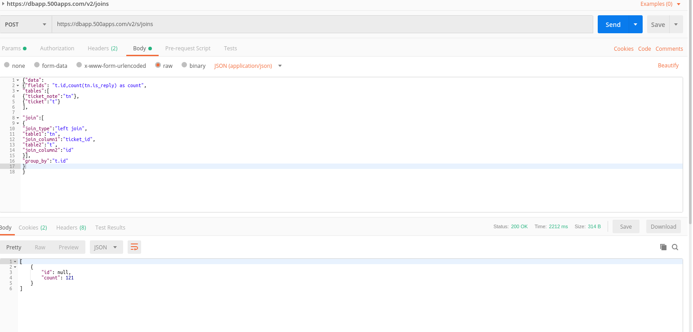

**************************************************

FILTERS
-------

1.Supported Data Types

* String

* Number

* Date

* Boolean

2.Supported Operators

* EQUALS - User has to pass EQ in the attribute

* NOT EQUALS - User has to pass NE

* LIKE - User has to pass LIKE

* NOT LIKE - User has to pass NOTLIKE

* IN - User has to pass IN

* NOT IN - User has to pass NOTIN

* IS NULL - User has to pass NULL

* IS NOT NULL - User has to pass NOTNULL

* BETWEEN - User has to pass BW

* NOT BETWEEN - User has to pass NBW

* STARTS WITH - User has to pass STARTSWITH

* NOT STARTS WITH - User has to pass NOTSTARTSWITH

* Ends with - User has to pass ENDS

* Not Ends with - User has to passNOTENDS

* To check empty data - EMPTY

* To check non empty data - NOTEMPTY

* '>' - User has to pass GT

* '<' - User has to pass LT

* '>=' - User has to pass GTE

* '<=' - User has to pass LTE

**Expression**: /s/filters

**Description** : This will be used to specify various filter criteria and retrieve the data from several tables.

**Input Type(JSON/Json Array/Form-Data)** : json object - raw data

**Rest Method**: POST

> A sample is shown here

**Trigger Expression** : [https://dbapp.500apps.com/v2/s/filters](https://dbapp.500apps.com/v2/s/filters)

**Method** : ”POST”

**json object - raw data**

{"data":{

"fields":"distinct c.id,c.first_name,c.last_name,c.tag,c.custom_value",

"tables":[{"contact_tag":"ct"},{"contact_details":"c"}],

"join":[{"join_type":"join","table1":"ct","join_column1":"contact_id","table2":"c","join_column2":"id"}],

"filters":[{"filter_condition":"","table_name":"ct","field_name":"tag_id","operator":"IN","value1":"'2','5'","value2":""}],

"jsonsearch":[{"filter_condition":"and","table_name":"c","field_name":"tag","operator":"SEARCH_VALUE","value1":"agile","value2":""}],

"order_by":"c.id",

"order_by_type":"desc",

"limit":"10",

"offset":"0"}}

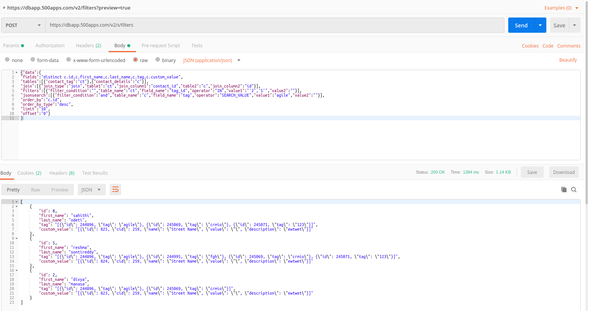

***************************

SEARCH
-------

**Expression**: /s/multi

**Description** : Let you do the search for multiple entities once at time, this  will useful.

**Input Type(JSON/Json Array/Form-Data)** : json object - raw data

**Rest Method**: POST

> A sample is shown here

**Trigger Expression** : [https://dbapp.500apps.com/v2/s/multi](https://dbapp.500apps.com/v2/s/multi)

**Method** : ”POST”

**json object - raw data**

{"fields":["json_object('name',subject,'email',requester_email)",

"json_object('name',concat(ifnull(first_name,''),' ',ifnull(last_name,'')))"],

"tablename":["ticket","contact"],

"where":[{"search_by":"subject,requester_email"},{"search_by":"first_name,last_name,email"}],

"search":"somi"}

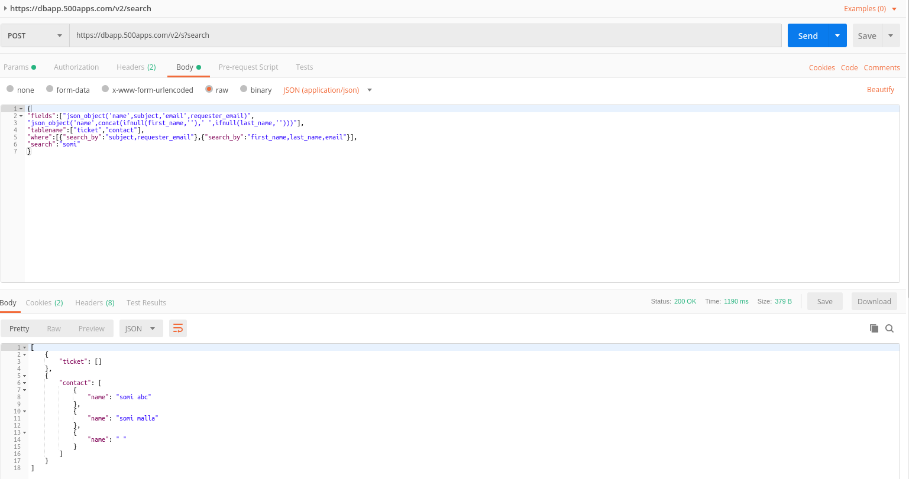

*******************************************

DESC
------

**Expression**: /m/desc/{table_name}

**Description** : Describe is used to describe the metadata of table. This will describe the structure of a table.

**Input Type(JSON/Json Array/Form-Data)** : path

**Rest Method**: GET

> A sample is shown here

**Trigger Expression** : [https://dbapp.500apps.com/v2/m/desc/ticket](https://dbapp.500apps.com/v2/m/desc/ticket)

**Method** : ”GET”

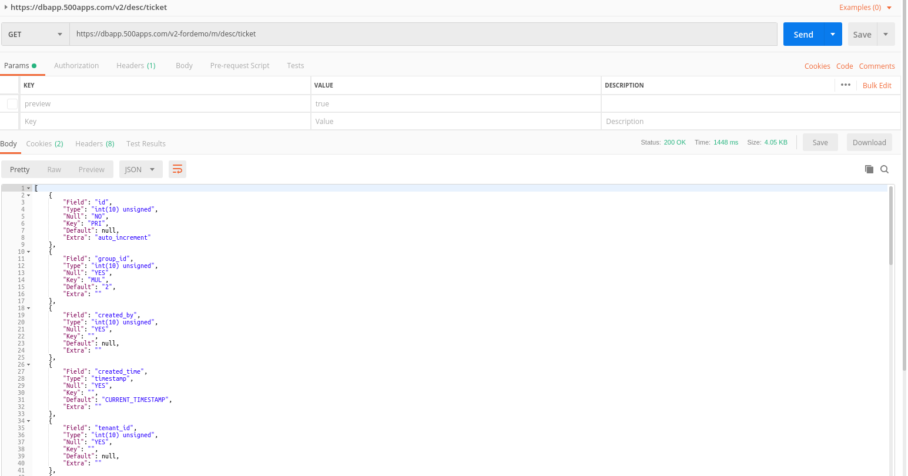

**********************************************

IMPORT
------

**Expression**: /m/import

**Description** : This  is used for import data from csv file.

**Input Type(JSON/Json Array/Form-Data)** : params,form data

**Rest Method**: POST

> A sample is shown here

**Trigger Expression** : [https://dbapp.500apps.com/v2/m/import](https://dbapp.500apps.com/v2/m/import)

**Method** : ”POST”

**params**

file_name:contact_import (5).csv

bucket_name:temptrash

table_name:staging

**form data**

fields : first_name,last_name

*****************************************************

EXPORT
------

**Expression**: /m/export

**Description** : This  is used for export data to csv file.

**Input Type(JSON/Json Array/Form-Data)** : params,json object - raw data

**Rest Method**: POST

> A sample is shown here

**Trigger Expression** : [https://dbapp.500apps.com/v2/m/export](https://dbapp.500apps.com/v2/m/export)

**Method** : ”POST”

**params**

bucket_name:temptrash

file_name:file1

**json object - raw data**

{"data":{

"fields": "c.id,c.first_name,c.last_name,c.email",

"tables":[{"contact":"c"},{"contact_phone":"cp"},{"contact_email":"ce"},{"company":"com"}],

"join":[{"join_type":"join", "table1":"c","join_column1":"id","table2":"cp","join_column2":"contact_id"},
{"join_type":"left join", "table1":"c","join_column1":"id","table2":"ce","join_column2":"contact_id"},
{"join_type":"left join", "table1":"c","join_column1":"id","table2":"com","join_column2":"contact_id"}],

"order_by":"id",

"limit":"9"}}

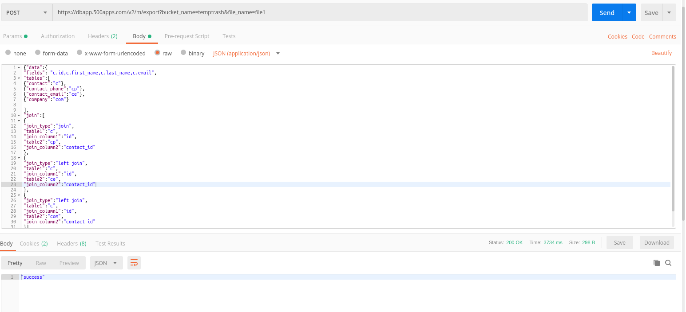

****************************************************

CUSTOM QUERIES
------

**Expression**: /cq/{entity_id}

**Description** : In this scenario we get the results based on customQueryId which we pass dynamically in rest call.

**Input Type(JSON/Json Array/Form-Data)** : params

**Rest Method**: GET

> A sample is shown here

**Trigger Expression** : [https://dbapp.500apps.com/v2/cq/11](https://dbapp.500apps.com/v2/cq/11)

**Method** : ”GET”

**params**

boolean_value=true

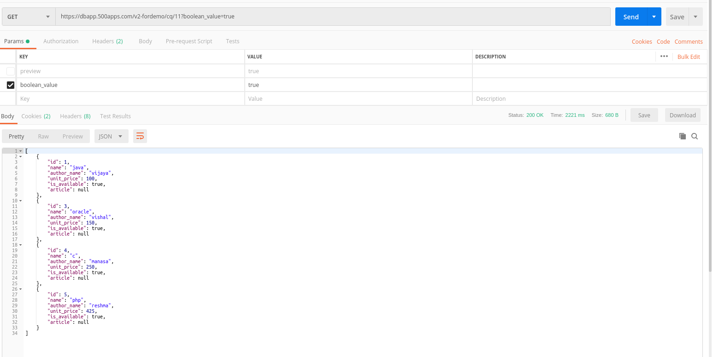

**************************************************

CUSTOM QUERIES INSERT
----------------------

**Expression**: /cq/{entity_id}

**Description** :  In this scenario we get the results based on customQueryId which we pass dynamically in rest call.

**Input Type(JSON/Json Array/Form-Data)** : json object - raw data

**Rest Method**: POST

> A sample is shown here

**Trigger Expression** : [https://dbapp.500apps.com/v2/cq/6](https://dbapp.500apps.com/v2/cq/6)

**Method** : ”POST”

**json object - raw data**

{

"fields":"'raju'"

}

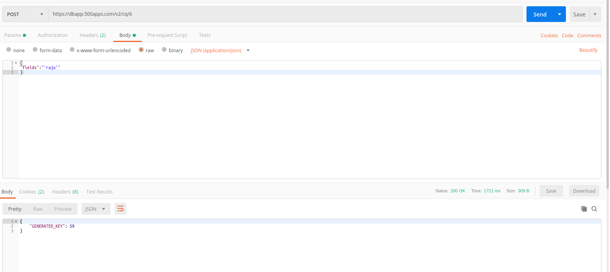

**************************************************

CUSTOM QUERIES UPDATE
----------------------

**Expression**: /cq/{entity_id}

**Description** :  In this scenario we get the results based on customQueryId which we pass dynamically in rest call.

**Input Type(JSON/Json Array/Form-Data)** : json object - raw data

**Rest Method**: PUT

> A sample is shown here

**Trigger Expression** : [https://dbapp.500apps.com/v2/cq/7](https://dbapp.500apps.com/v2/cq/7)

**Method** : ”PUT”

**json object - raw data**

{

	"update_name":"test",
  
	"id":"4"
  
}

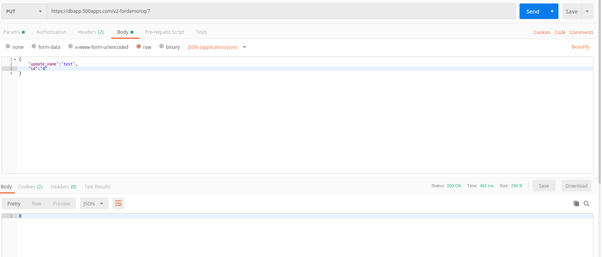

************************************************************

REPORTS
--------

* Bar Chart

**Expression**: /r/bar

**Description** :  This is used for reports barchart.

**Input Type(JSON/Json Array/Form-Data)** : json object - raw data

**Rest Method**: POST

> A sample is shown here

**Trigger Expression** : [https://dbapp.500apps.com/v2/r/bar](https://dbapp.500apps.com/v2/r/bar)

**Method** : ”POST”

json object - raw data

{{raw-data}}

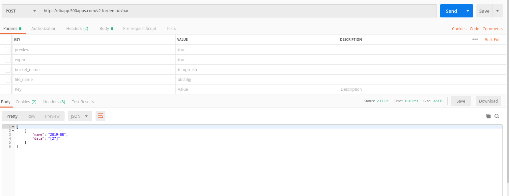

* Line Chart

**Expression**: /r/line

**Description** :  This is used for reports linechart.

**Input Type(JSON/Json Array/Form-Data)** : json object - raw data

**Rest Method**: POST

> A sample is shown here

**Trigger Expression** : [https://dbapp.500apps.com/v2/r/bar](https://dbapp.500apps.com/v2/r/bar)

**Method** : ”POST”

json object - raw data

{{raw-data}}

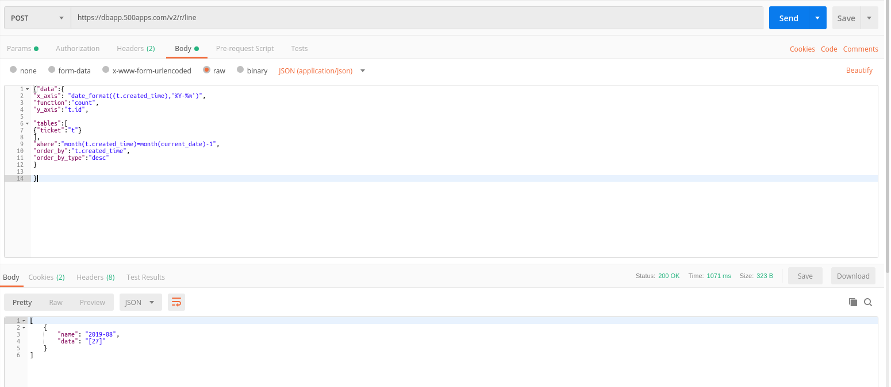

* Funnel Chart

**Expression**: /r/fc

**Description** :  This is used for reports funnelchart.

**Input Type(JSON/Json Array/Form-Data)** : json object - raw data

**Rest Method**: POST

> A sample is shown here

**Trigger Expression** : [https://dbapp.500apps.com/v2/r/bar](https://dbapp.500apps.com/v2/r/bar)

**Method** : ”POST”

json object - raw data

{{raw-data}}

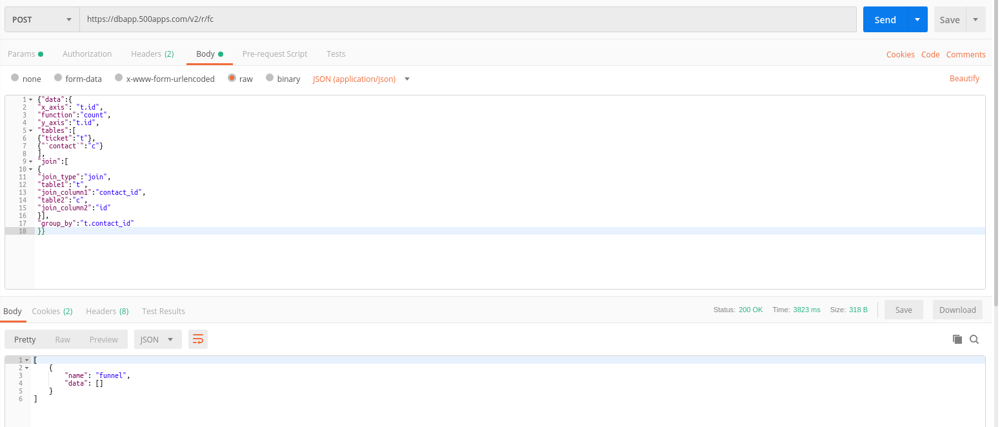

* Pie Chart

**Expression**: /r/pie

**Description** :  This is used for reports piechart.

**Input Type(JSON/Json Array/Form-Data)** : json object - raw data

**Rest Method**: POST

> A sample is shown here

**Trigger Expression** : [https://dbapp.500apps.com/v2/r/bar](https://dbapp.500apps.com/v2/r/bar)

**Method** : ”POST”

json object - raw data

{{raw-data}}

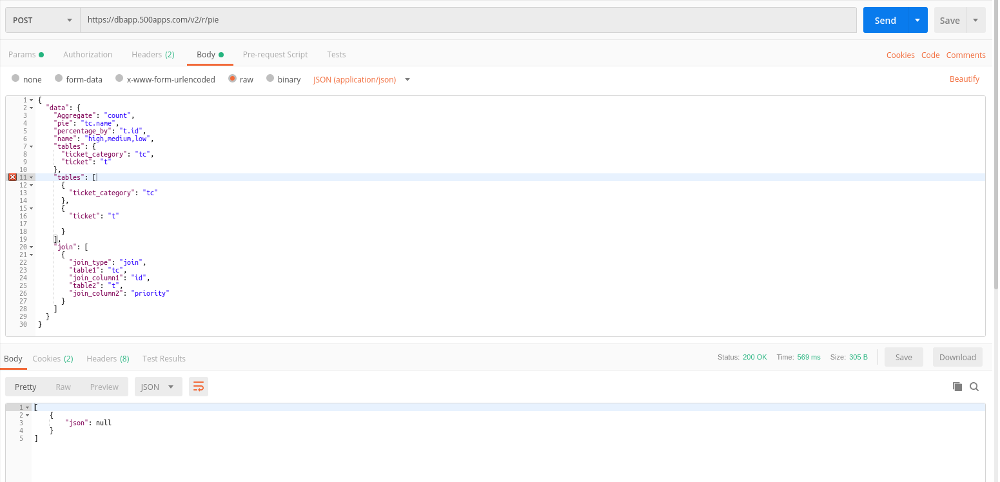
