 
 Generic DB App will be useful for programmers who work with database operations.
 
 In the application properties, Need to set the following key-values;
 
 **1. id_type** - have to give tenant_id/domain_id based on the column name which is present in your schema tables.
 
 
 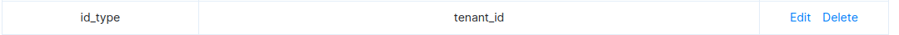
 
 **2. tablename** - need to mention the table names for which the crud operations to be performed. The table names which you give in the trigger path must match the tablenames which we give here then only the result is retrived.
 
 
 
 **3. activity.{{parent_table}}** - the child tablenames whose data must be stored separated in activity tables when you perform any action(insert,update,delete) are mentioned here .
 
 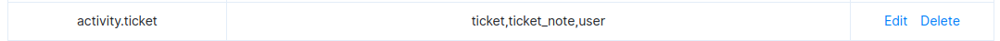
 
 **4. version_tables** - the tablenames for which their versions are need to be stored are named here. For each entity there will be separate entity_version table.
 
 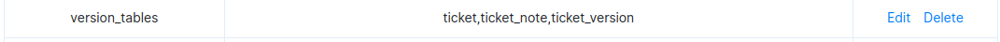
 
 **5. Limit** - by deafult the limit is set to 100 to limit the retrived records when you don't give the limit in the query params while retrieving data or in the application properties as mentioned below. If we need to retrieve more than 100 records the number is to be mentioned in the app properties as shown below
 
 

JOINS
-----------

 Joins are used to combine data or rows from two or more tables based on a common field between them.
 Joins help retrieving data from two or more database tables. 
 The tables are mutually related using primary and foreign keys.

 There are different types of joins available in SQL −

**JOIN** − returns rows when there is a match in both tables.

**LEFT JOIN** − returns all rows from the left table and matched rows from the right table, even if there are no matches in the right table.

**RIGHT JOIN** − returns all rows from the right table and matched rows from the left table, even if there are no matches in the left table.

**Expression**: /s/joins

**Description** : This  will be used for joining multiple tables and get records.

**Input Type(JSON/Json Array/Form-Data)** : json object - raw data

**Trigger Expression** : /s/joins

**Method** : ”POST”

**json object - raw data**

{"data":{

"fields": "t.id,count(tn.is_reply) as count",

"tables":[{"ticket_note":"tn"},{"ticket":"t"}],

"join":[{"join_type":"left join", "table1":"tn","join_column1":"ticket_id","table2":"t","join_column2":"id"}],

"group_by":"t.id"}}

* fields - columns are to be specified, else "*" is directly appended automatically 
* tables - are mandatory and must contain at least two tables
* join_type - the type of join must be specified(join,left join,right join).
* where - condition is optional, it can be used to specify criteria in the result set returned from the query.
* group_by - is used to put together records that have the same field values and this condition is optional.
* having - condition is used to specify criteria when working using the group_by keyword and this condition is optional.
* order_by - is used to specify the sort order of the result set and this condition is optional.

**Rest Call** - https://dbapp.500apps.com/v2/s/joins

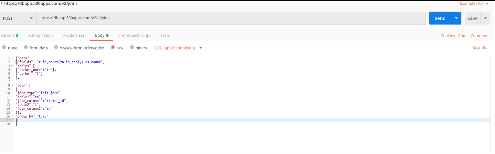

**returns**

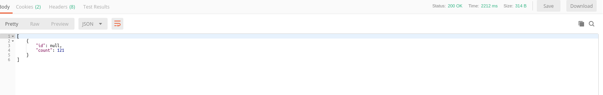

**************************************************

FILTERS
-------

**Description** : This will be used to specify various filter criteria and retrieve the data from several tables.

1.Supported Data Types

* String

* Number

* Date

* Boolean

2.Supported Operators

* EQUALS - User has to pass EQ in the attribute

* NOT EQUALS - User has to pass NE

* LIKE - User has to pass LIKE

* NOT LIKE - User has to pass NOTLIKE

* IN - User has to pass IN

* NOT IN - User has to pass NOTIN

* IS NULL - User has to pass NULL

* IS NOT NULL - User has to pass NOTNULL

* BETWEEN - User has to pass BW

* NOT BETWEEN - User has to pass NBW

* STARTS WITH - User has to pass STARTSWITH

* NOT STARTS WITH - User has to pass NOTSTARTSWITH

* Ends with - User has to pass ENDS

* Not Ends with - User has to passNOTENDS

* To check empty data - EMPTY

* To check non empty data - NOTEMPTY

* '>' - User has to pass GT

* '<' - User has to pass LT

* '>=' - User has to pass GTE

* '<=' - User has to pass LTE

**Expression**: /s/filters

**Input Type(JSON/Json Array/Form-Data)** : json object - raw data

**Trigger Expression** : /s/filters

**Method** : ”POST”

**json object - raw data**

{"data":{

"fields":"distinct c.id,c.first_name,c.last_name,c.tag,c.custom_value",

"tables":[{"contact_tag":"ct"},{"contact_details":"c"}],

"join":[{"join_type":"join","table1":"ct","join_column1":"contact_id","table2":"c","join_column2":"id"}],

"filters":[{"filter_condition":"","table_name":"ct","field_name":"tag_id","operator":"IN","value1":"'2','5'","value2":""}],

"jsonsearch":[{"filter_condition":"and","table_name":"c","field_name":"tag","operator":"SEARCH_VALUE","value1":"agile","value2":""}],

"order_by":"c.id",

"order_by_type":"desc",

"limit":"10",

"offset":"0"}}

**Rest Call** - https://dbapp.500apps.com/v2/s/filters

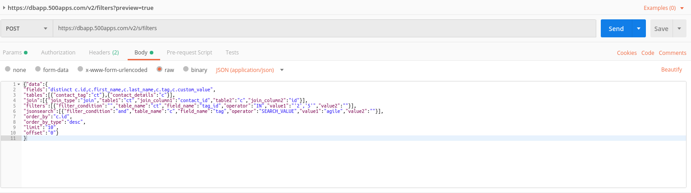

**returns**

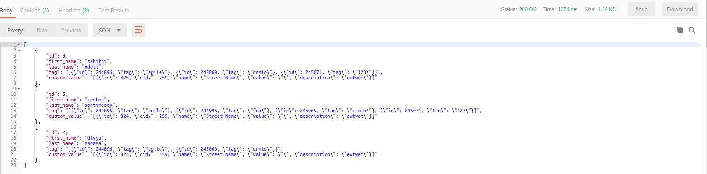

***************************

SEARCH
-------

**Expression**: /s/multi

**Description** : Let you do the search for multiple entities once at time when there is either relation or no relation between those multiple entities, this  will useful.

**Input Type(JSON/Json Array/Form-Data)** : json object - raw data

**Trigger Expression** : s/multi

**Method** : ”POST”

**json object - raw data**

{"fields":["json_object('name',subject,'email',requester_email)",

"json_object('name',concat(ifnull(first_name,''),' ',ifnull(last_name,'')))"],

"tablename":["ticket","contact"],

"where":[{"search_by":"subject,requester_email"},{"search_by":"first_name,last_name,email"}],

"search":"somi"}

**Rest Call** - https://dbapp.500apps.com/v2/s/multi

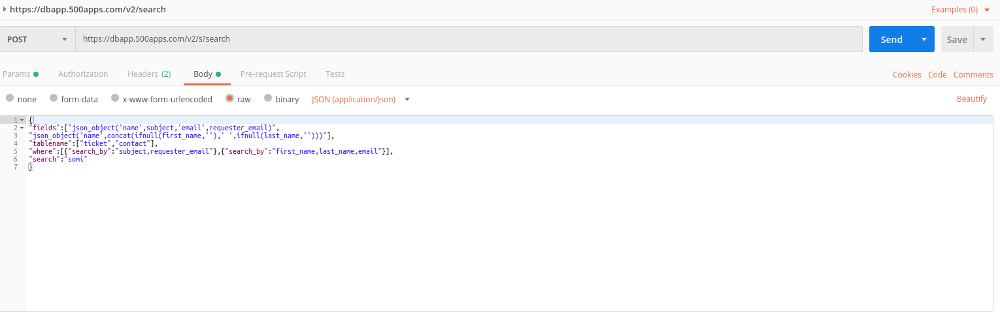

**returns**

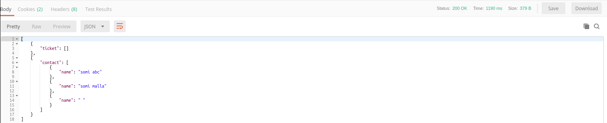

*******************************************

IMPORT
------

**Expression**: /m/import

**Description** : This is used for import data from csv file into staging table.

**Input Type(JSON/Json Array/Form-Data)** : params,form data

**Trigger Expression** : m/import

**Method** : ”POST”

**params**

file_name:contact_import (5).csv

bucket_name:temptrash

table_name:staging

**form data**

fields : first_name,last_name

**Rest Call** - https://dbapp.500apps.com/v2/m/import

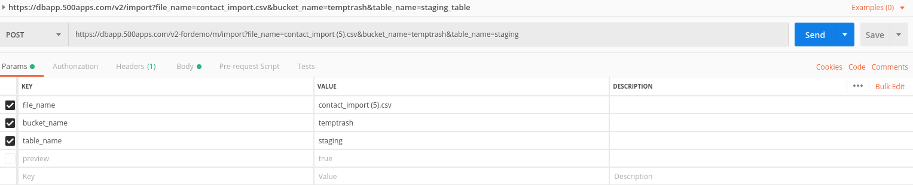

**returns**

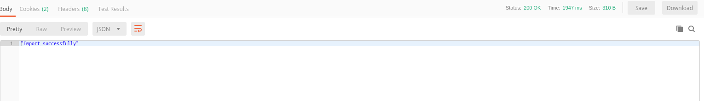

****************************************************

CUSTOM QUERIES
------

 **custom.query.{{id}}** - the complex query which couldnot be achieved through the existing dbapp operations need to be added here. We get the results based on customQueryId which we pass dynamically in rest call.(id must be unique)
 
 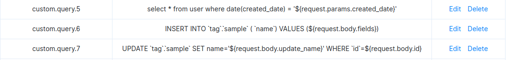

**Description** : In this scenario we get the results based on customQueryId which we pass dynamically in rest call.

**Input Type(JSON/Json Array/Form-Data)** : params

**Trigger Expression** : cq/{customQueryId}

**Method** : ”GET”

**params**

boolean_value=true

**Rest Call** - https://dbapp.500apps.com/v2/cq/11

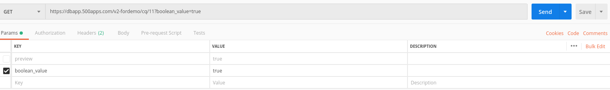

**returns**

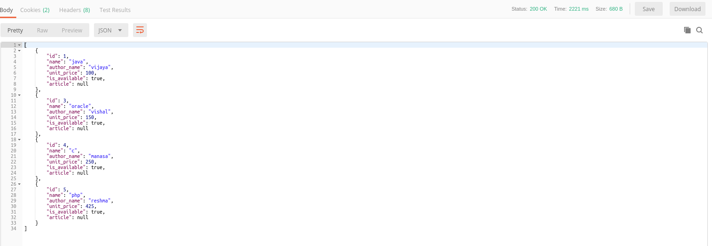

**************************************************

CUSTOM QUERIES INSERT
----------------------

 **custom.query.{{id}}** - the complex query which couldnot be achieved through the existing dbapp operations need to be added here. We get the results based on customQueryId which we pass dynamically in rest call.(id must be unique)
 
 

**Description** :  In this scenario we get the results based on customQueryId which we pass dynamically in rest call.

**Input Type(JSON/Json Array/Form-Data)** : json object - raw data 

**Trigger Expression** : cq/{customQueryId}

**Method** : ”POST”

**json object - raw data**

{

"fields":"'raju'"

}

**Rest Call** - https://dbapp.500apps.com/v2/cq/6

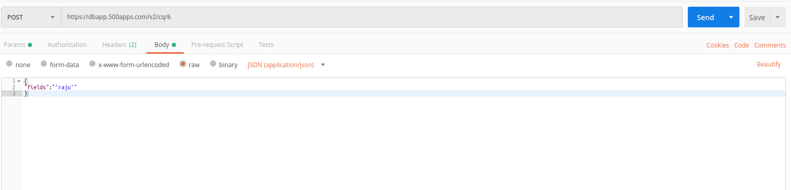

**returns**

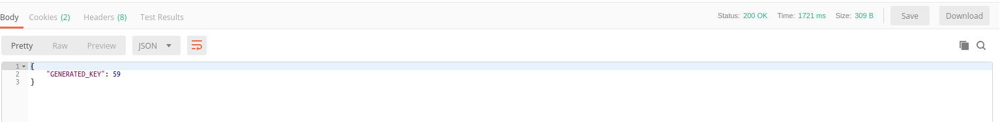

**************************************************

CUSTOM QUERIES UPDATE
----------------------

 **custom.query.{{id}}** - the complex query which couldnot be achieved through the existing dbapp operations need to be added here. We get the results based on customQueryId which we pass dynamically in rest call.(id must be unique)
 
 

**Description** :  In this scenario we get the results based on customQueryId which we pass dynamically in rest call.

**Input Type(JSON/Json Array/Form-Data)** : json object - raw data

**Trigger Expression** : cq/{customQueryId}

**Method** : ”PUT”

**json object - raw data**

{

"update_name":"test",

 "id":"4"  
 
}

**Rest Call** - https://dbapp.500apps.com/v2/cq/7

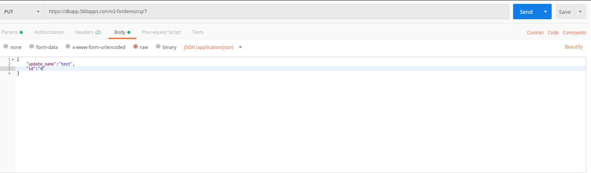

**returns**

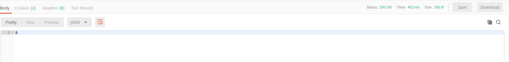

************************************************************

REPORTS
--------

**Bar Chart**

**Description** : A bar chart is a chart that presents categorical data with rectangular bars with heights or lengths proportional to the values that they represent.

**Expression**: /r/bar

**Input Type(JSON/Json Array/Form-Data)** : json object - raw data

**Trigger Expression** : /r/bar

**Method** : ”POST”

**json object - raw data**

{"data":{ 

"x_axis": "date_format((t.created_time),'%Y-%m')",

"function":"count",

"y_axis":"t.id",

"tables":[{"ticket":"t"}],

"where":"month(t.created_time)=month(current_date)-1",

"order_by":"t.created_time",

"order_by_type":"desc"}}

**Rest Call** - https://dbapp.500apps.com/v2/r/bar

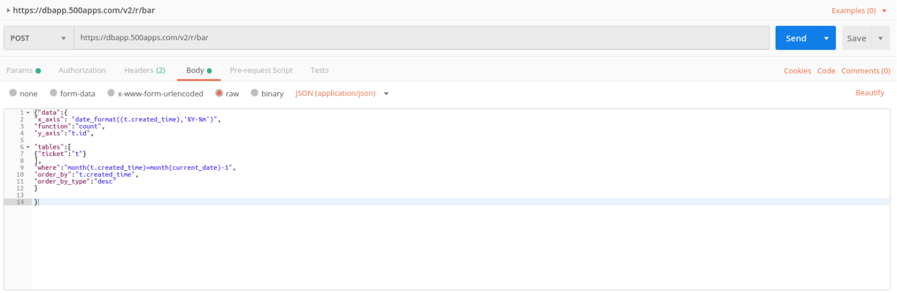

**returns**

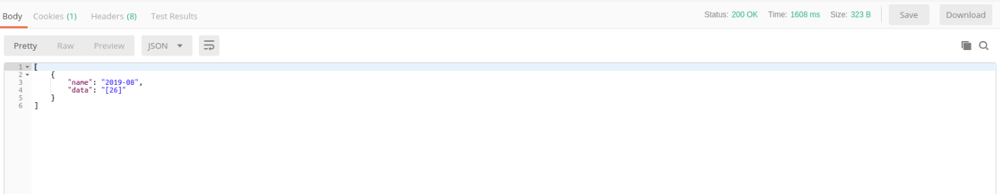

**Line Chart**

**Description** : A line chart is a type of chart which displays information as a series of data points called 'markers' connected by straight line segments.

**Expression**: /r/line

**Input Type(JSON/Json Array/Form-Data)** : json object - raw data

**Trigger Expression** : /r/line

**Method** : ”POST”

**json object - raw data**

{"data":{ 

"x_axis": "date_format((t.created_time),'%Y-%m')",

"function":"count",

"y_axis":"t.id",

"tables":[{"ticket":"t"}],

"where":"month(t.created_time)=month(current_date)-1",

"order_by":"t.created_time",

"order_by_type":"desc"}}

**Rest Call** - https://dbapp.500apps.com/v2/r/line

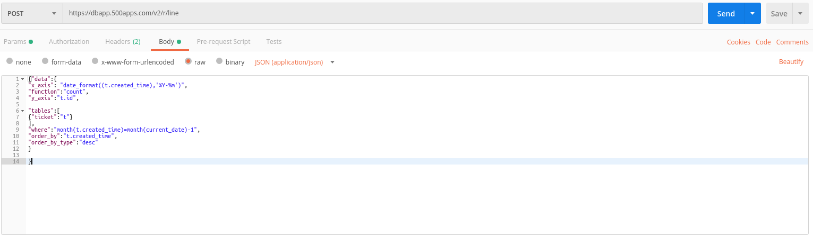

**returns**

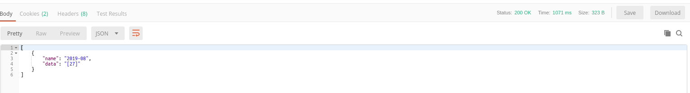

**Funnel Chart**

**Description** : Funnel charts are a type of chart, often used to represent stages in a sales process and show the amount of potential revenue for each stage. This type of chart can also be useful in identifying potential problem areas in an organization's sales processes.

**Expression**: /r/fc

**Input Type(JSON/Json Array/Form-Data)** : json object - raw data

**Trigger Expression** : /r/fc

**Method** : ”POST”

**json object - raw data**

{"data":{ 

"x_axis": "t.id",

"function":"count",

"y_axis":"t.id",

"tables":[{"ticket":"t"},{"`contact`":"c"}],

"join":[{"join_type":"join","table1":"t","join_column1":"contact_id","table2":"c","join_column2":"id"}],

"group_by":"t.contact_id"}}

**Rest Call** - https://dbapp.500apps.com/v2/r/fc

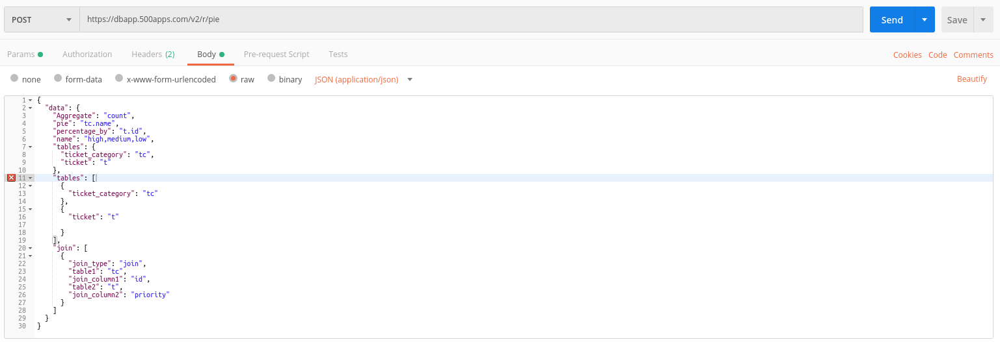

**returns**

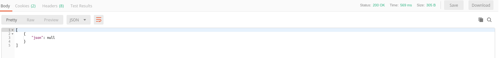

**Pie Chart**

**Description** :  A pie chart is a circular statistical graphic, which is divided into slices to illustrate numerical proportion.

**Expression**: /r/pie

**Input Type(JSON/Json Array/Form-Data)** : json object - raw data

**Trigger Expression** : /r/pie

**Method** : ”POST”

**json object - raw data**

{"data": {

"Aggregate": "count",

"pie": "tc.name",

"percentage_by": "t.id",

"name": "high,medium,low",

"tables": {"ticket_category": "tc","ticket": "t"},

"tables": [{"ticket_category": "tc"},{"ticket": "t"}],

"join": [{"join_type": "join","table1": "tc","join_column1": "id","table2": "t","join_column2": "priority"}]

}}

**Rest Call** - https://dbapp.500apps.com/v2/r/pie

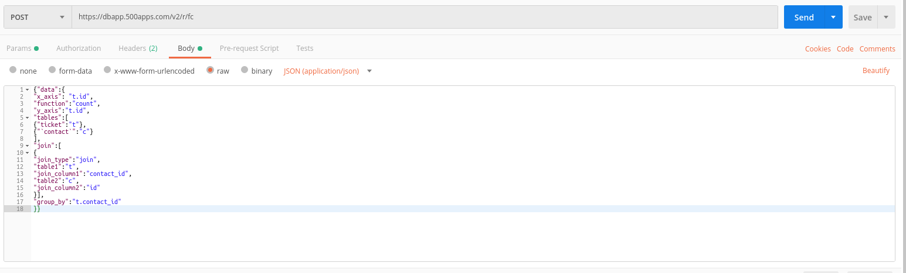

**returns**

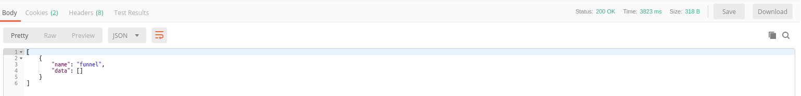
